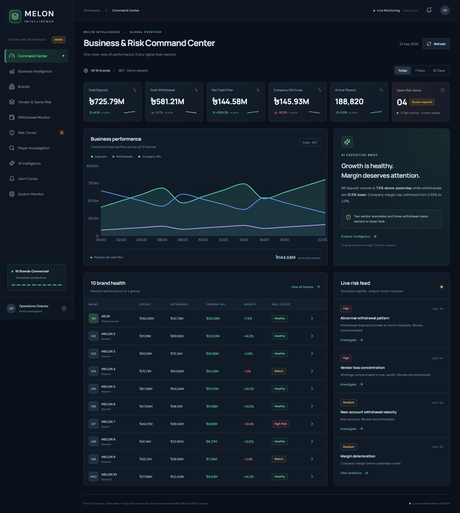

# MELON Intelligence

**Business & Risk Command Center — management proof of concept**

A desktop-first operations demo for a future ten-brand MELON monitoring platform. All player identities, history, vendor results, risk signals, connections and AI responses are fictional. M1 / MCW financial metrics use the supplied reference figures. No credentials, backend, database, Telegram integration or AI API are included.

## Run locally

Requires Node.js 22.12+ and npm.

```powershell
npm ci
npm run dev
```

Open http://localhost:5173. To build and preview:

```powershell
npm run lint
npm run build
npm run preview
```

The preview runs at http://localhost:4173. UI workflow checks use Playwright with installed Microsoft Edge:

```powershell
npx playwright test
```

## Presentation route

1. **Command Center:** network KPIs, financial-flow chart, ten-brand health, M1 executive brief and actionable risk feed.
2. **Business Intelligence:** open MCW; switch daily, weekly and monthly comparisons; inspect acquisition, turnover and margin.
3. **Brands:** filter health status and open any brand's synthetic analytics.
4. **Vendor & Game Risk:** open JILI to review historical performance, game, concentration and contributing players.
5. **Withdrawal Monitor:** filter high-priority or new-account withdrawals, then open a fictional player.
6. **Risk Center:** review explainable scores and case status.
7. **Player Investigation 360:** inspect finances, bets, access signals and score contributions. Mark reviewed, escalate, clear or generate an alert.
8. **AI Intelligence:** select a sample prompt or enter a topic. Responses are predefined and explicitly labeled.
9. **Alert Center:** inspect Telegram-style previews and review linked cases. Nothing is transmitted.
10. **System Monitor:** inspect simulated brand connections and the planned production pipeline.

Use **Refresh** to update the simulated sync timestamp. Case and alert actions are shared across screens for the current session; reloading resets the demo. Historical aggregates and chart distributions are synthetic rather than reconstructed BO records. Risk priority is not a fraud probability or determination. AI cannot make or enforce a decision.

## Visuals and implementation

The interface uses dark navy surfaces, restrained green/cyan accents, compact financial tables, responsive Recharts visualizations and Lucide icons. Desktop and mobile reference captures are in `docs/` after validation.

- `src/App.tsx`: navigation and coordinated demo workflows.
- `src/components/ui.tsx`: reusable panels, charts, KPI cards, badges and priority scores.
- `src/data/demo.ts`: typed financial, brand, vendor, investigation and analyst fixtures, with demo-source metadata; comparison and formatting helpers.
- `src/styles.css`: responsive presentation system and reduced-motion support.
- `tests/demo.spec.ts`: navigation, filtering, investigation, alert, AI, refresh and mobile checks.

Built with React, Vite, TypeScript, Recharts and Lucide. Plain CSS keeps the visual system compact. No server or environment secrets are required. Fonts use a public Google Fonts stylesheet with local sans-serif fallbacks.

## Planned production architecture

10 authorized MELON BO sources → Collector / Zeusflow → PostgreSQL → Analytics Engine → Risk Engine → AI Agent → Dashboard → Telegram.

This diagram describes future work, not deployed components. A production version will require authorized source access, authentication and permissions, historical data validation, calibrated detection, audit trails and human review workflows. Replace typed mock fixtures with an authorized API adapter, retaining clear source metadata.

## Future phases

1. M1 authenticated data collector.
2. PostgreSQL historical intelligence.
3. Ten-brand monitoring.
4. Anomaly / risk engine.
5. AI investigation.
6. Telegram alerts and case workflow.

## Demo limitations

No live financial data, real player information or fraud findings. The 7-day / 30-day values are generated comparisons. Vendor and individual-bet tables are illustrative samples, not a reconciled ledger. Example AI summaries refer to the fixed M1 daily snapshot. Refresh preserves stable mock financial figures for a repeatable presentation. Actions affect only in-memory demo state and do not process withdrawals or contact external services.

## Validation

Validated at 1440 × 1000 desktop and 390 × 844 mobile viewports in Microsoft Edge. ESLint, TypeScript/Vite production build, and all three Playwright tests pass. Tests cover main navigation, period changes, brand/withdrawal/risk filters, vendor drill-down, case review/escalation/clearing, alert generation, AI prompts, refresh, mobile overflow, and financial/chart reconciliation. Dependency installation reported zero known vulnerabilities.



[Player investigation screenshot](docs/player-investigation-desktop.png) · [Mobile screenshot](docs/command-center-mobile.png)
